# T3-A2
Physio program prescribing web application developed by Kane Campbell, Steve Todorovic and Oliver Wong

## The Purpose of our App

We hope to provide individuals with a tool that enables them to create bespoke exercise programs and track their progress. The programs will comprise of individual exercises either created by the user, or chosen from a list of provided exercises. The user will be able to track the completion of the exercises on a day by day basis from a progress bar that will fill up dynamically until the all the exercises assigned for the day are completed. Users will be able to sign up and log into their account which will contain any routines they have been created ans a summery of completed results and their account details.  

## Target Audience

- Physical rehabilitation patients 
- People new to exercise
- Elderly people looking to start exercising
- Athletes
- People lacking motivation to exercise

## User Stories

### User Story One - Jason (Rehab Patient)

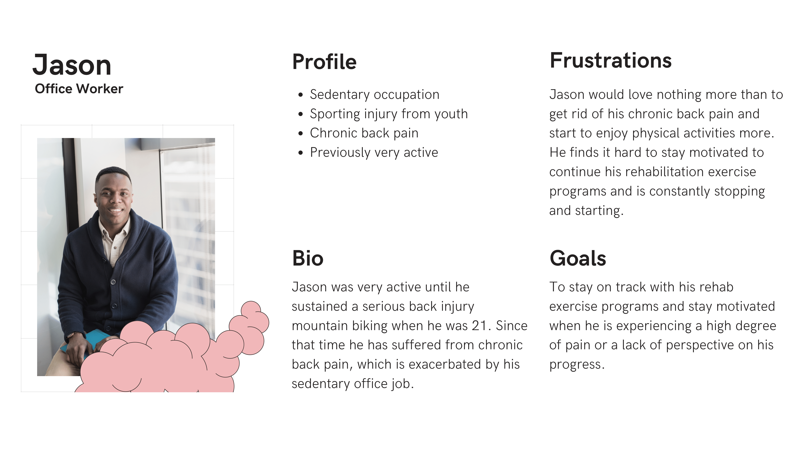

### User Story Two - Judy (Athlete)

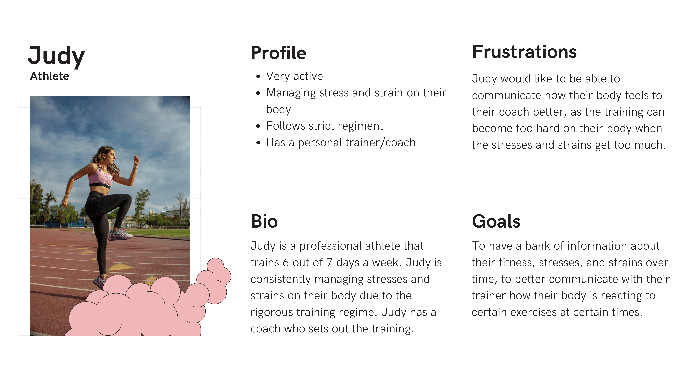

### User Story Three - Elaine (Active Senior)

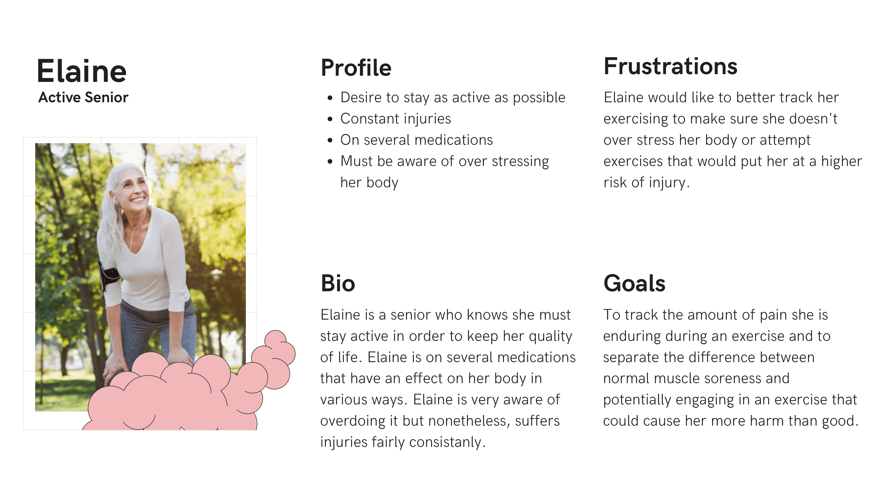

## Functionality & Features   

The main feature will be exercise/pose instructions (cards) with diagrams or pictures to help explain movements and technique. Each exercise card will contain relevant information on the exercise and an image or instructional diagram. The information that can be including will consist of repetitions, time to hold certain positions and any other instructions the user might want to include. The images and diagrams will give a visual representation of the exercise to guide the student. The users will be able to tick off exercises as they complete them.  

***Additional Features***  

The first of the additional features will be the feedback mechanism. This will give users the ability to gather valuable information which in turn will help the user increase or decrease the intensity of the program depending on their progression. The information that will be tracked with the feedback feature will include the difficulty to perform the exercise and a level of discomfort (pain) experienced during the exercise. The level of discomfort and difficulty feedback systems will use a rating system from one to ten.  

A visualisation of the users progression in the form of a graph, using information obtained from their exercise feedback. This will give both the user a visual overview of the students journey, and allow for closer analysis of patterns that may emerge. The information to be presented will be exercise completion, overall pain during a routine and overall difficulty of a routine.  

## Tech Stack
- MERN Stack
- Figma
- Draw.IO
- Trello
- Canva
- Key Dependencies/Packages
- Railway

## Data Flow Diagrams

The Data Flow Diagram task was split up into two diagrams so that it would be easier to understand and read. This is because there is one user entity and over 30 processes of data moving back and forth. As such, we divided the diagram by collection; one for the user collection and the other for the program collection.

It is important to note that for the program collection DFD, it is implied that the user is logged in/authorized and that that data process has already been completed.

### User Collection Data Flow Diagram

### Program Collection Data Flow Diagram

## Application Architecture Diagram

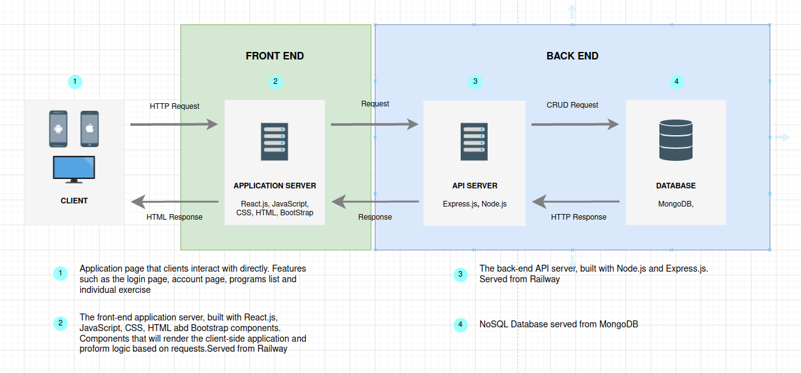

## Wireframes (Responsive Design)

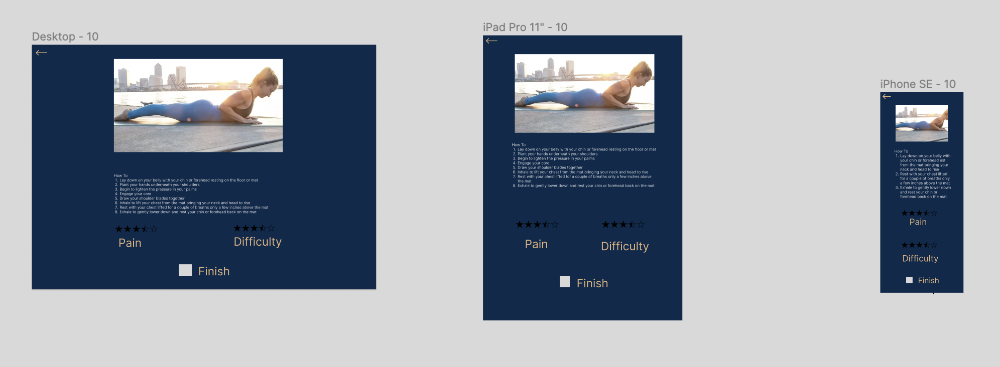
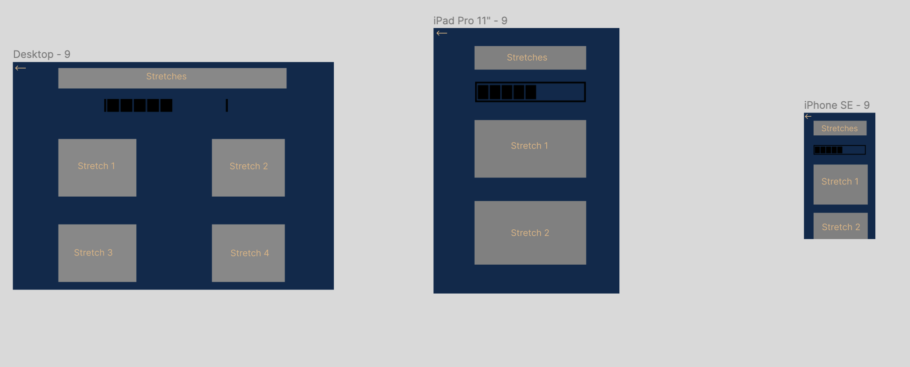
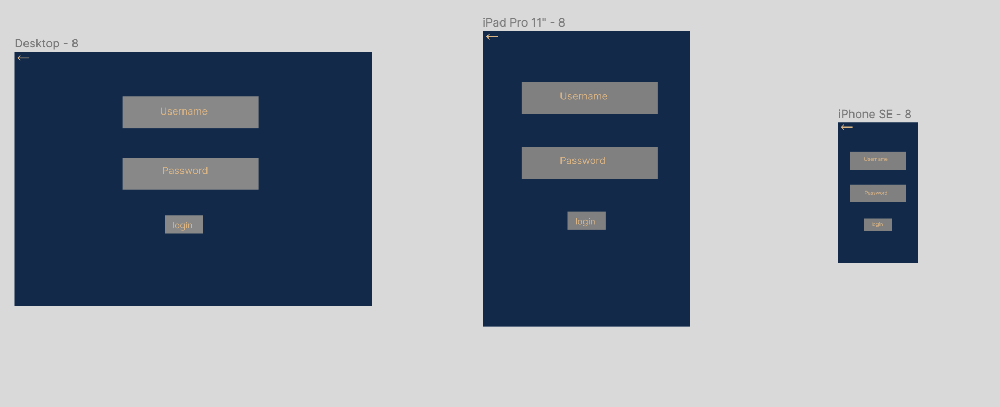
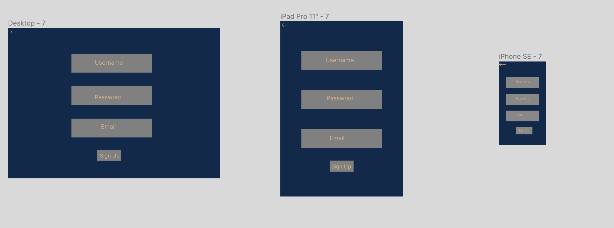
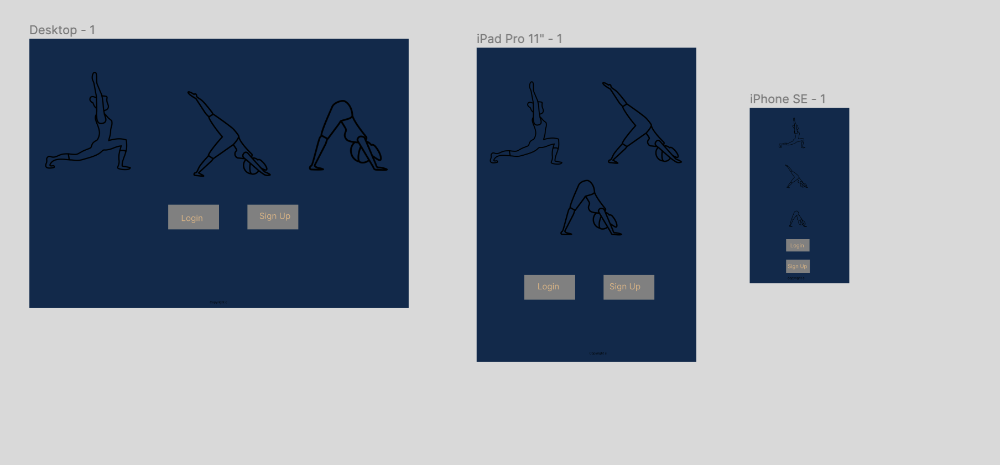
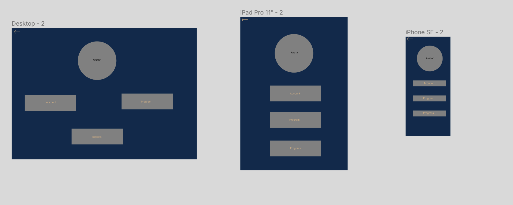
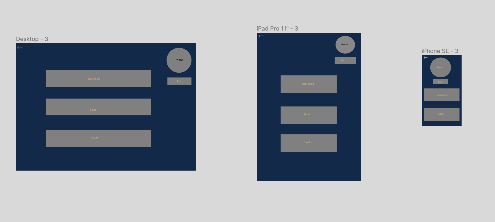
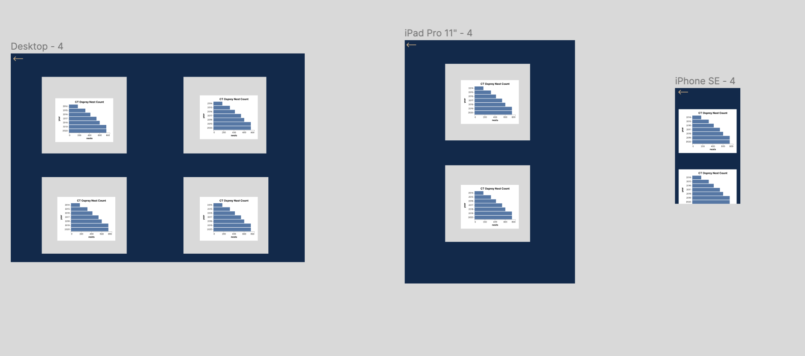
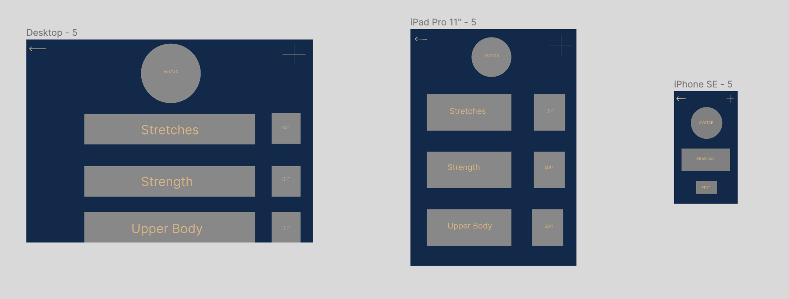
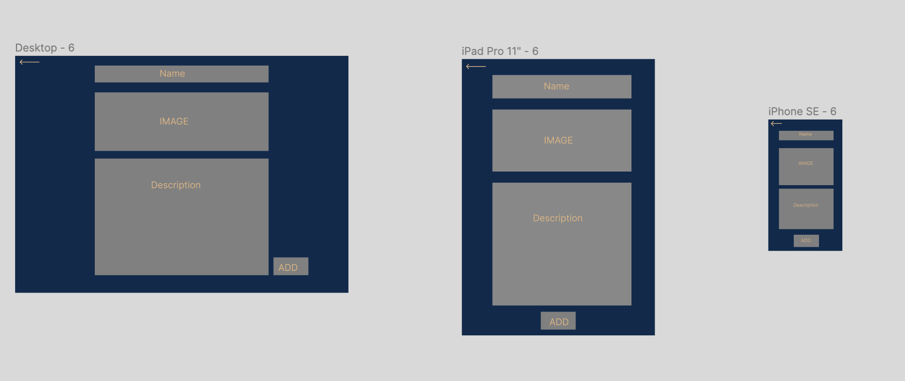

## Trello

### 17/01/22 (Tuesday)

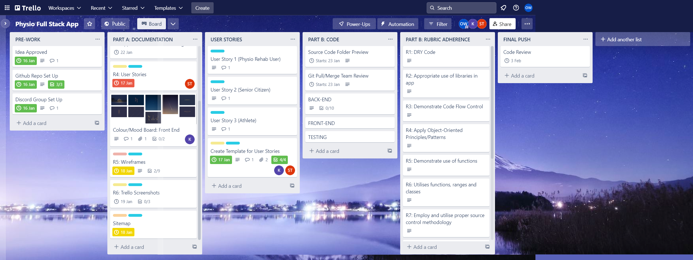

As a team we begun confirming what our idea would look like, what features we could add and what would be a bonus if we had time. After we were happy with this, we set out to divide our tasks and used Trello to motivate the team. We would assist on individual tasks if our team needed help.

- Kane begun with wireframes.
- Steve worked on user stories templates, the description of the application and sitemap imagination.
- Oliver worked on the Trello board, setting up the git repo and assisting Steve with the vision of the project.

### 18/01/22 (Wednesday)

After having our organisational process set up and our idea cemented, we continued on our work from yesterday. Kane continued to work on our design element; throwing design ideas for us to agree on and further getting through the task of the wireframes.

Steve was tasked with the software architecture diagram as well as helping Oliver to get across the data flow diagram.

Oliver worked on the data flow diagram with Steve and found the collaboration made it a smoother process of understanding. 

The team also sought help from the support educator on campus (Iryna) to understand what the database/collections/documents would look like so future structural problems of integration could be mitigated.

### 19/01/22 (Thursday)

<!-- KEY QUESTIONS -->

<!-- 1. Can the instructor create exercises or should they pulled from an API/DB  -->

<!-- Seeding exercises, own database, instructor can add exercises. -->

<!-- 2. Working out the admin login. -->